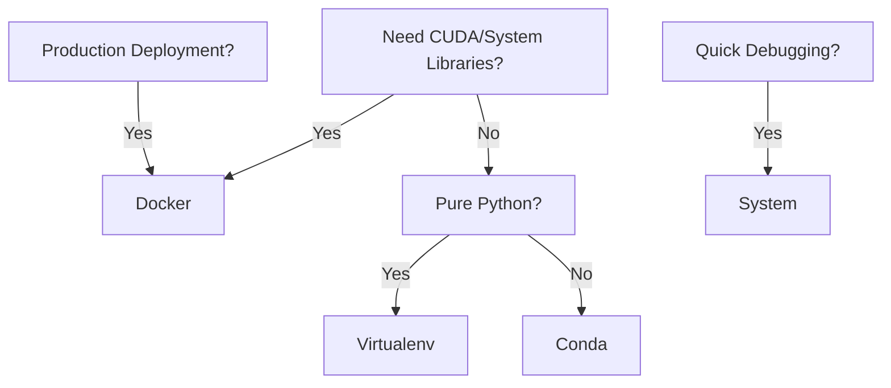

## Project Scenario: Iris Classifier
**Files:**
- `train.py` (training script)
- `data/iris.csv` (input data)
- `requirements.txt`/`conda.yaml` (dependencies)
---
## 1. System Environment
### Basic
```bash
pip install -r requirements.txt
python train.py --data_path data/iris.csv
```
### With MLFlow
***MLproject***
```yaml
name: iris_system
entry_points:
  main:
    parameters:
      data_path: path
    command: "python train.py --data_path {data_path}"
```

```bash
# Install dependencies manually
pip install -r requirements.txt

# Run with local environment
mlflow run . --env-manager=local -P param=value
```
> [!tip] Best Practices:
> -  Only for local debugging
> -  Document system requirements
> - Avoid for collaborative projects
---
## 2. Virtualenv Environment
*Isolated Python environment with pip-installed packages*
- Supports **Python packages** from PyPI.
- Creates an **isolated environment** using `virtualenv` and `pyenv`.
- Automatically **activates** before running project code.
- Define in the **MLproject** file using a **python_env** entry.
### Environment Management

| Command                                   | Description                      |
| ----------------------------------------- | -------------------------------- |
| `python -m venv myenv`                    | Create a new virtual environment |
| `source myenv/bin/activate` (Linux/macOS) | Activate environment             |
| `.\myenv\Scripts\activate` (Windows)      | Activate environment             |
| `deactivate`                              | Deactivate environment           |
### Basic Example
```bash
# 1. Create & activate env
python -m venv iris-env
source iris-env/bin/activate # linux
# For windows: .\iris-env\Scripts\activate
pip install -r requirements.txt

# 2. Install packages
pip install numpy pandas
# or 
pip install -r requirements.txt

# Export env for sharing if needed for reproducability
pip freeze > requirements.txt

# 3. Run the project
python train.py --data_path path/to/data/to/be/trained

# 4. Deactivate when done (optional)
deactivate
```
### With MLFlow

1. Create empty files
```bash
$ echo '' > python_venv.yaml
$ echo '' > MLproject
```
2. After creating the empty files. Follow this structure to create the environment yaml file as well as the MLproject file.
***iris_venv.yaml:*** you can use any name.
```yml
python: "3.8.10"
dependencies:
  - pip
  - pip:
      - mlflow==2.4.1
      - scikit-learn==1.0.2
      - pandas==1.5.0
```
***MLproject***
```yml
python_env: python_venv.yaml
entry_points:
  train:
    command: "python train.py --data_path {data_path}"
```
3. To execute the entire project write the following in the bash.
``` bash
mlflow run .
```
> [!tip] Best Practices:
> - Pin all versions (`==1.0.2`)
> - Rebuild when changing dependencies
> - Ideal for pure Python projects
---
## 3. Conda Environment
***Isolated environment with Python + optimized native libraries.***
- Supports **Python packages** and **native libraries** (e.g., CuDNN, Intel MKL).
- Activates the Conda environment **before** executing project code.
- 1.Define in the **MLproject** file using a **conda_env** entry.
### Environment Management
> [!note] For more commands , see this [cheat sheet](https://docs.conda.io/projects/conda/en/4.6.0/_downloads/52a95608c49671267e40c689e0bc00ca/conda-cheatsheet.pdf)

| Problem                        | Solution                                                      |
| ------------------------------ | ------------------------------------------------------------- |
| **Conda command not found**    | Ensure Conda is in `PATH` or reinstall Anaconda/Miniconda     |
| **Environment not activating** | Restart terminal or use `source activate myenv` (Linux/macOS) |
| **Package not found**          | Try `conda install -c conda-forge package_name`               |
| **Broken environment**         | `conda clean --all` then recreate the env                     |
#### Useful Shortcuts
- `conda info` → Check Conda version and info  
- `conda config --show` → Show Conda configuration  
- `conda clean --all` → Remove cached packages and temporary files  
### Basic Example
```bash
# 1. Create & activate env
# conda create --name <env_name> python=<python_version>
conda create --name iris-env python=3.8.10 -y
# Use `-y` to accept all pakages with -n instead of --name
# conda create -n iris_env python=3.8.10 -y, 
# To create a Conda environment from a `conda.yaml` file
# conda env create -n conda.yaml
conda activate iris-env

# 2. Install packages
pip install numpy pandas
# or 
pip install -r requirements.txt

# Export env for sharing if needed for reproducability
conda env export --no-builds > environment.yml

# 3. Run the project
python train.py --data_path path/to/data/to/be/trained

# 4. Deactivate & remove when done (optional)
conda deactivate
conda env remove --name iris-env
```
> [!note] We can execute a Conda-based project as a **virtualenv** environment using: `mlflow run /path/to/conda/project --env-manager Virtualenv`
### With MLFlow
1. Create empty files
```bash
$ echo '' > conda.yaml
$ echo '' > MLproject
```
2. After creating the empty files. Follow this structure to create the environment yaml file as well as the MLproject file.
***conda.yaml:***
```yml
name: iris-env
channels:
  - conda-forge
dependencies:
  - python=3.8.10
  - cudatoolkit=11.3
  - pip:
    - mlflow==2.4.1
    - scikit-learn==1.0.2
    - pandas==1.5.0
    - numpy=1.21.5
```
***MLproject***
```yml
conda_env: conda.yaml
entry_points:
  train:
    command: "python train.py --data_path {data_path}"
```
3. To execute the entire project write the following in the bash.
``` bash
mlflow run .
```
#### Best Practices:
- Specify channel priorities
- Separate Python/native dependencies
- Check Anaconda licensing

> [!tip] Best Practices:
> - Specify channel priorities
> - Separate Python/native dependencies
> - Check Anaconda licensing
---

## 4. Docker Environment
***Complete OS-level containerization***
- Captures non-Python dependencies (e.g., Java libraries).
- Runs pre-built Docker images with configurations from the MLproject file.
- An MLproject file is mandatory to define the Docker environment.
### Basic
```dockerfile
# Dockerfile
FROM python:3.8-slim
COPY . /app
WORKDIR /app
RUN pip install -r requirements.txt
CMD ["python", "train.py"]
```
### With MLFlow

1. Create empty files
```bash
$ echo '' > Dockerfile
$ echo '' > MLproject
```
2. After creating the empty files. Follow this structure to create the image file as well as the MLproject file.
```Dockerfile
FROM python:3.8-slim
COPY . /app
WORKDIR /app
RUN pip install -r requirements.txt
CMD ["python", "train.py"]
```
3. Create MLproject
```yaml
name: iris_docker
docker_env:
  image: python:3.8-slim
  volumes: ["data:/data"]
entry_points:
  main:
    parameters:
      data_path: path
    command: "python train.py --data_path {data_path}"
```
4. To auto-build an image use the `--build-image` flag with `mlflow run`
```bash
mlflow run . --build-image
```
> [!tip] Best Practices:
> - Use slim base images
> - Explicit volume mapping
> - Clean unused containers

---
## Comparison Table

| Feature      | System  | Virtualenv | Conda       | Docker  |
| ------------ | ------- | ---------- | ----------- | ------- |
| Isolation    | ❌       | Python     | Python+Libs | Full OS |
| Setup Time   | Instant | 30s        | 1-3m        | 5m+     |
| Reproducible | ❌       | ✅          | ✅           | ✅✅      |
| GPU Support  | ❌       | ❌          | ✅           | ✅✅      |
